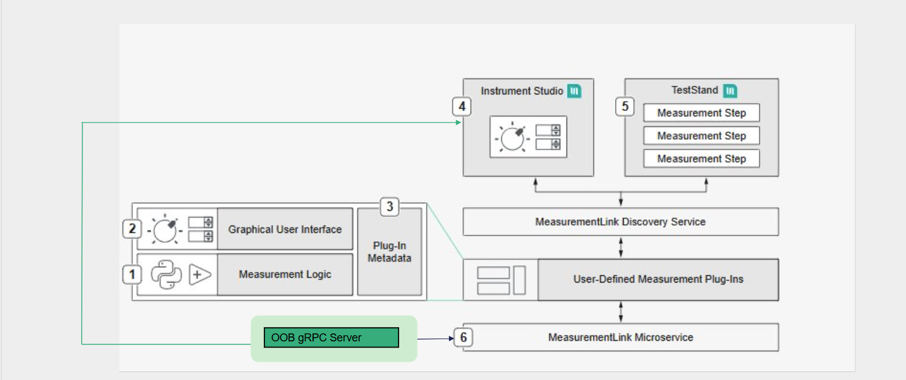

# Automotive Interface Plugins for InstrumentStudio

This repo houses the source code for the Automotive Interface Plugins for InstrumentStudio.
## Use Case

These plugins perform the following actions:    

1. Enable users to automate tests for multiple DUTs using tools like TestStand..
2. Offer a reusable set of components for building and improving additional plugins.
3. Help users to learn about workflow and test life cycle.
4. Expose users to NI Hardware and NI Software.

## Architecture  
The diagram below illustrates the architecture of the plugins. 

The plugins have a few major components.  The first component is the GUI, which allows the user to control the inputs, receive outputs and handles all of the user interactions.  
The second component is the Measurement Logic which handles the backend logic for each plugin.  
Synchronous communication transfers inputs from the GUI to the Measurement Logic before it starts, and transfers outputs to the GUI after it ends.
A gRPC service allows for asynchronous communication between the GUI and the backend of the plugin.  

## Prerequisites

The plugins were developed using:
*   **LabVIEW 2025 Q3**
* **InstrumentStudio 2025 Q4**
* **Measurement Plugin SDK 3.5.0.2**

Specific hardware and software requirements for each plugins can be found on the documentation of the plugin.

## Documentation
This document contains links to the READMEs for the various plugins, resources and the build for installer instructions.

### Plugin Documentation:

[Automotive Ethernet Bus Monitor](src/labview/auto-eth/README.md)

[Automotive Vision Acquisition](src/labview/auto-vision/README.md)

[CAN/LIN Raw Bus Capture](src/labview/can-lin/README.md)

[CAN/LIN Frame Generator](src/labview/can-lin%20generator/README.md)

[I2C Capture Plugin](src/labview/i2c/README.md)

### Resources Documentation

[UI Assets](src/labview/UI%20Assets/README.md)

[gRPC Example](src/labview/grpc-example/README.md)

[gRPC Template](src/labview/grpc-template/README.md)

### Build for Installer Documentation:

[Build for Installer](src/builds/README.md)
