# Prerequisites

- **LabVIEW 2025 Q3**
- **Instrument Studio 2025 Q4**.
- **NI PXIe-8510** with NI-XNET-CAN and/or NI-XNET-LIN transceiver

# Build Instructions

This document outlines how to build the hardware validation plugins for release.

Please see the manual for any extra information: [NI Package Builder](https://www.ni.com/docs/en-US/bundle/ni-package-builder/page/manual-overview.html).

## Build Steps

The steps to build the plugin are below:

1. Install NI Package Builder (Make sure to install LabVIEW and TestStand as well).
2. Open up the plugins you wish to build in Labview and build them.     

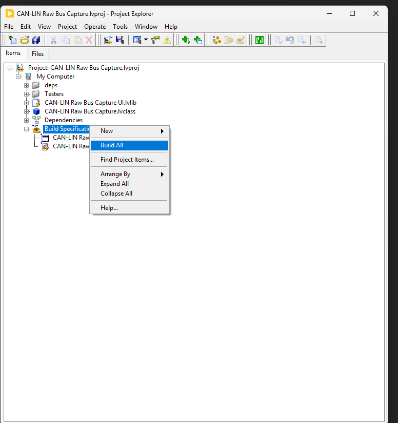

After building, the plugins and libraries should be placed here: [hardware-validation/src/labview/builds](../../labview/builds/).

&nbsp;
3. Open up NI Package Builder 64bit. 

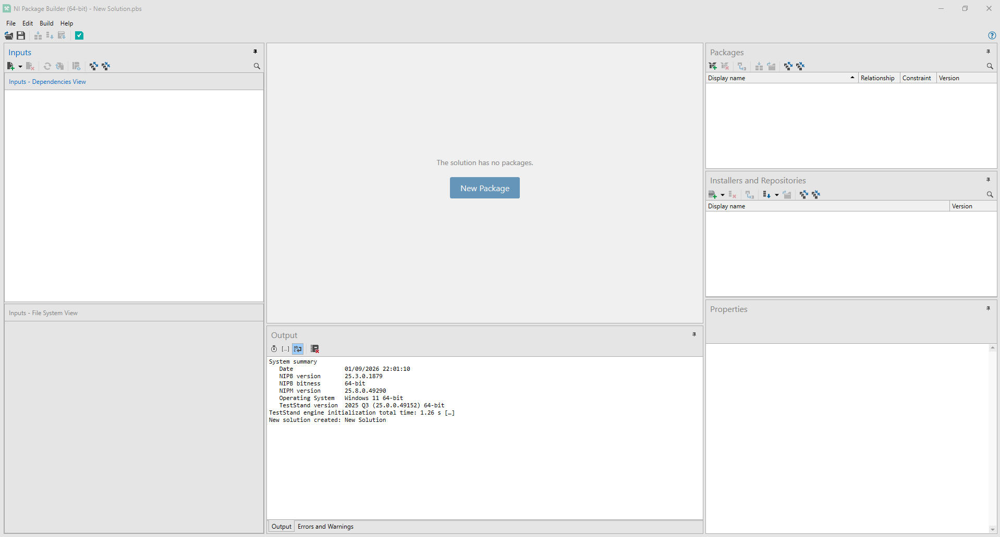
&nbsp;
4. Select New Package from the center screen. It should now look like the following:    

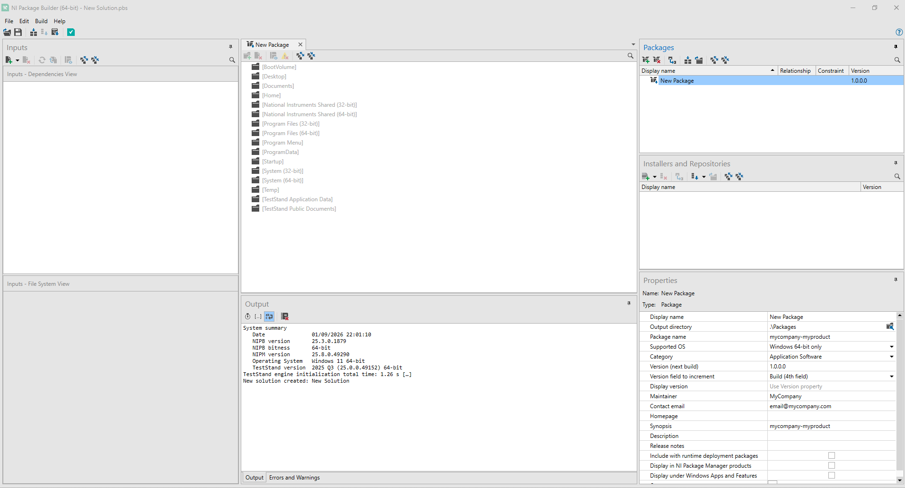

In the Packages panel on the right, select "New Package".  
Then, in the lower right 'Properties' panel, fill in the properties for the package to be built.   

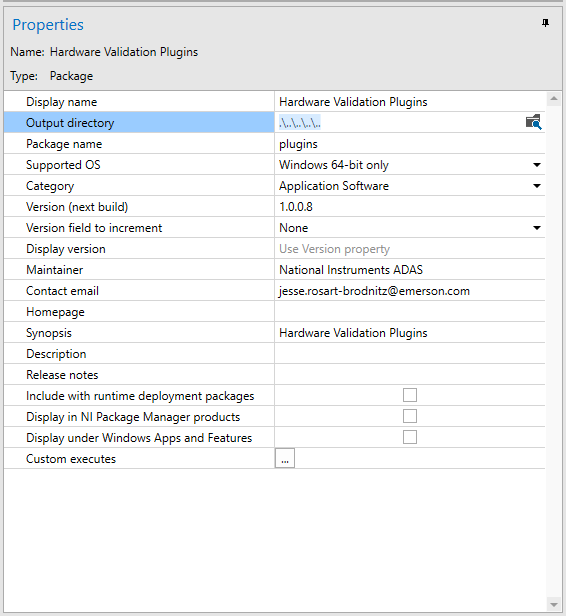

Under Output Directory, specify a directory with a short path, such as *C:\Users\Admin\Documents\builds*.  
If the directory does not exist, please create it.  
Specify the version for the next build.  
When the package is built, the installer will be placed here.

&nbsp;
5. Go to the Inputs panel in the top left, and add the path: hardware-validation/src/labview/builds.    

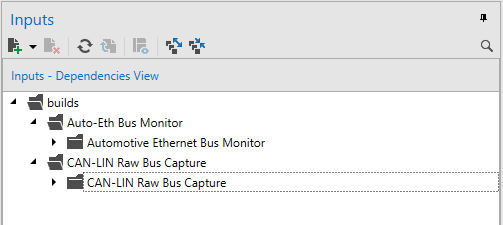

Expand each of the plugins down one level.  
&nbsp;
6. Go to the center panel and ensure the following path exists: *C:\ProgramData\National Instruments\Plug-Ins\Measurements*.  
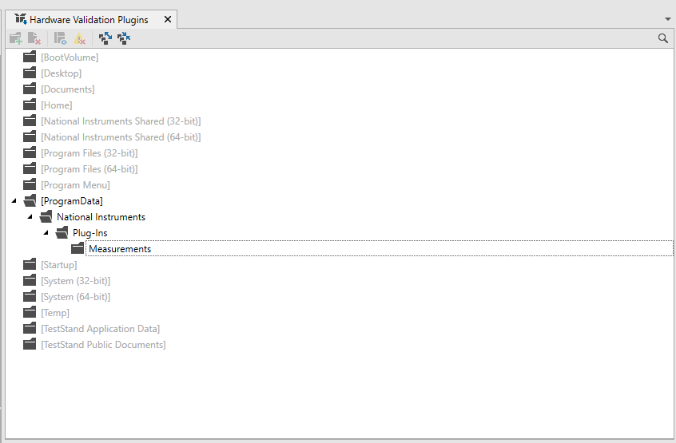

&nbsp;
7. Add the desired plugins into the package by dragging the plugin from the Input panel into the Measurements folder in the center panel.  
Note: Select the inner folders, not the outer folders expanded in step 5. If the outer folders are selected, the path is more likely to be too long.

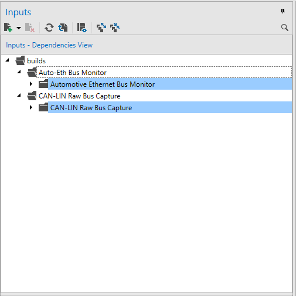

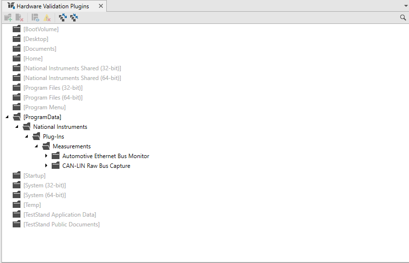

The plugins should be inside the Measurements folder.  
After installation, this is where the plugins are installed. This location allows the Measurement services to be found by Instrument Studio.

&nbsp;
8. Build the package by selecting the 'Build all Packages' button on the toolbar.     
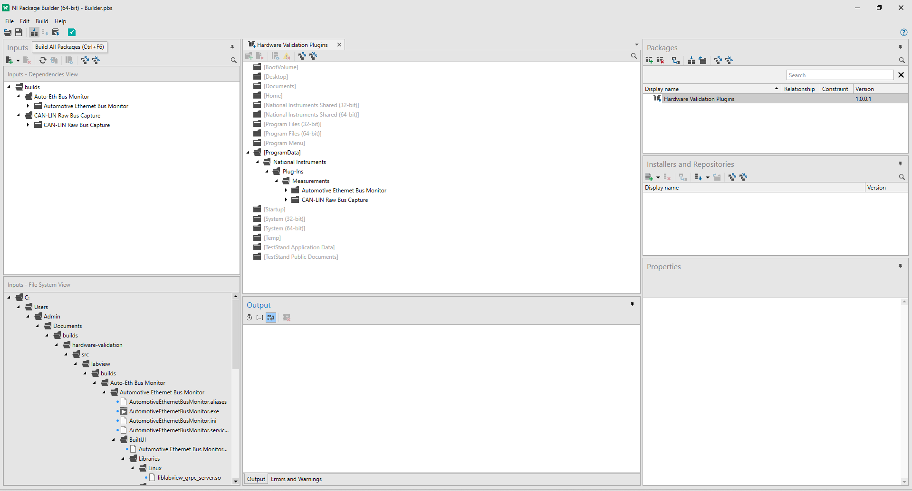

The built package will be located here: *C:\Users\Admin\Documents\builds*

## Install steps
1. In this location, C:\Users\Admin\Documents\builds, run the NIPM package install file and navigate through the prompts.  
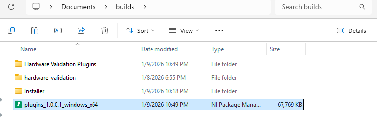

2. If everything worked correctly, at the location C:\ProgramData\National Instruments\Plug-Ins\Measurements, 
the following files should be present.  
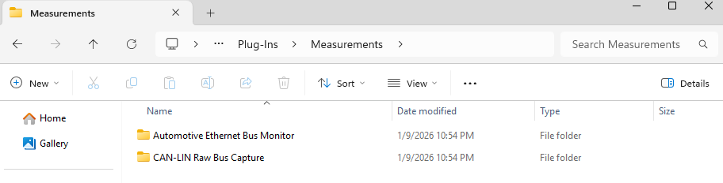

    The plugins should now be visible in Instrument Studio.     
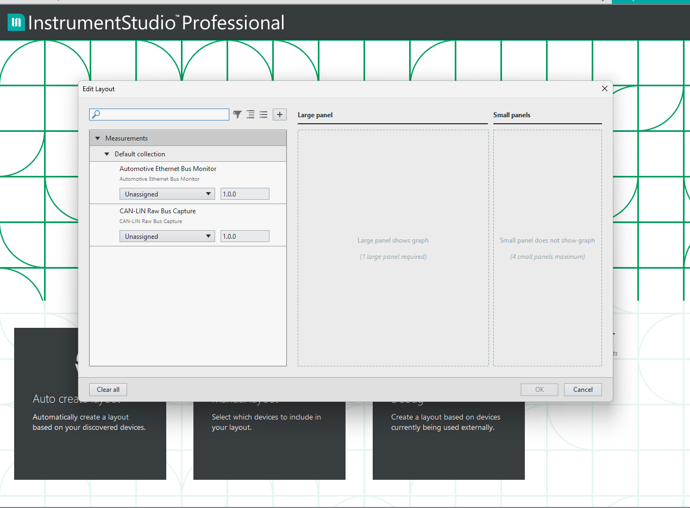