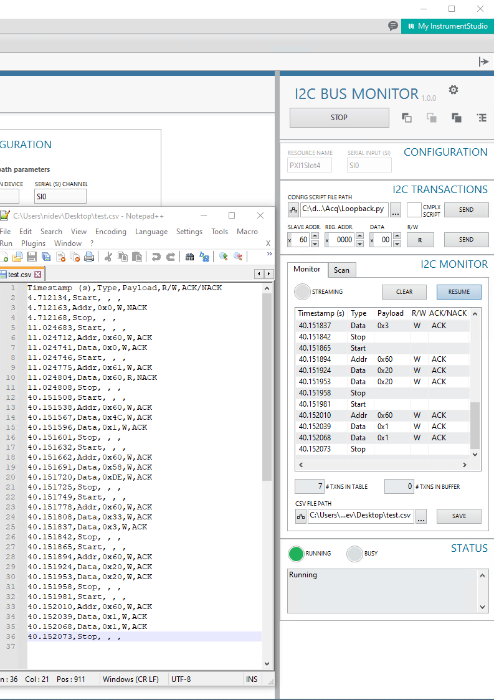
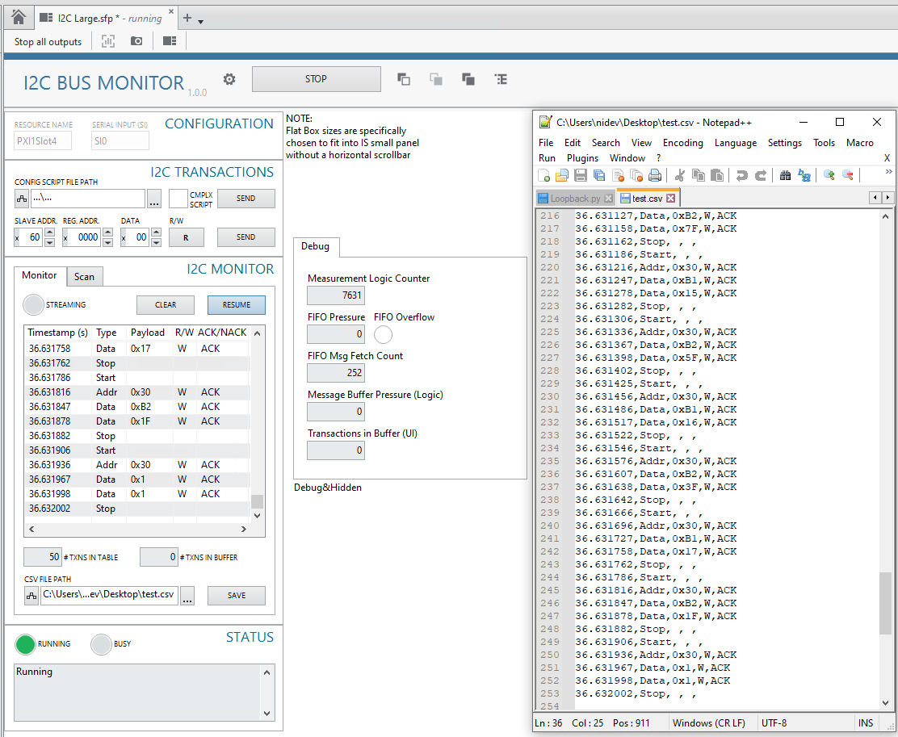
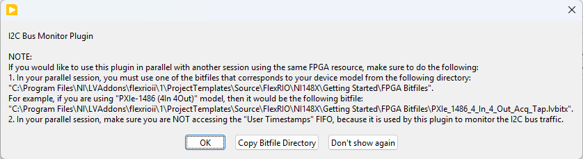
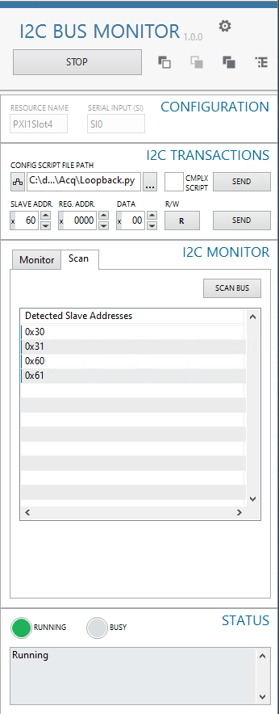

# I2C Bus Monitor Plugin for Instrument Studio

This plugin provides an **I2C bus monitor, scanner, and transaction tool** inside **Instrument Studio 2025**, implemented with the **Measurement Plugin SDK** in **LabVIEW 2025**.

It is intended to be used as a **Small Panel** in Instrument Studio (a **Large Panel** for the I2C Bus Monitor plugin can be useful for debugging).   
It is most useful when used alongside the Automotive Vision Capture Plugin in a **Large Panel**.  
It is possible to use it in parallel with a FlexRIO Getting Started Example (GSE) with the instructions given in the I2C Bus Monitor startup dialog.

Key capabilities:

* **I2C Bus Monitor**: high-throughput capture into a monitor table (bulk FIFO reads + buffering).
* **I2C Transactions**: send a single transaction or run configuration scripts.
* **I2C Bus Scan**: probe for responding slave addresses (ACK).
* **Save CSV**: export the current monitor table to a CSV file.
* **Status + indicators**: running/streaming/busy plus error/status text.

***

## Prerequisites
* **LabVIEW 2025 Q3 or newer**  
	NI Drivers:
    * **NI-FlexRIO with Integrated I/O 2025 Q3 or newer**
* **Instrument Studio 2025 Q4 or newer**
* **Measurement Plugin SDK 3.5.0.2 or newer**  (Installed through VI Package Manager)
* A supported NI PXIe GMSL/FPD-Link FlexRIO module that has a Serial Input channel (e.g. 4in4out or 8in variant):
	* **PXIe-1486**
	* **PXIe-1487**
	* **PXIe-1488**
	* **PXIe-1489**

***

## Running the plugin in Instrument Studio

These screenshots show the plugin running after it has been added to a panel and shows a CSV file that has been saved and opened in Notepad++:





***

## Startup Dialog

On startup, the plugin displays a dialog describing how to use the plugin **in parallel** with another FPGA session.



The dialog includes:

* **Don’t show again** button
* **Copy Bitfile Directory** button (copies the folder path to the clipboard)

### “Don’t show again” persistence

This is primarily intended for the built EXE:

* The EXE’s `.ini` contains a key controlling whether the startup dialog appears.
* Default is **True** (show dialog).
* Clicking **Don’t show again** sets it to **False**.

### Bitfile directory

When using a parallel FPGA session, the parallel session needs to use bitfiles from this directory:

```
C:\Program Files\NI\LVAddons\flexrioii\1\ProjectTemplates\Source\FlexRIO\NI148X\Getting Started\FPGA Bitfiles
```

### User Timestamps FIFO

When using a parallel FPGA session, the parallel session needs to make sure it is not accessing the User Timestamps FIFO, because it is used by this plugin for monitoring the I2C Bus traffic.

***

## Configuration

The plugin UI populates:

* **Device Resource Name**
* **SI Channel** (serial channel)

Select the appropriate device and channel before starting the measurement.  
Note that the plugin will throw an error if it doesn't find supported hardware on the system.

***


## I2C Transactions

The plugin supports:

### Send Single Transaction

Send a single I2C transaction from the UI.

### Send Script

Run a configuration script.

#### Complex Script option (Python scripts)

For Python configuration scripts (`.py`) that contain more complex function calls, enable the **Complex Script** option.

If **Complex Script** is disabled, scripts are executed significantly faster than GSE.

***
## I2C Bus Monitor

### Monitor Table

This plugin is designed to handle I2C traffic efficiently by batching and buffering:

* **Logic side** reads the FPGA FIFO **in bulk** and buffers into a **logic-side internal buffer**.
* **UI side** fetches I2C transactions via gRPC **in bulk** and buffers into a **UI-side internal buffer**.
* The UI updates the **monitor table** by **dequeuing the UI buffer in bulk**.

### Pause / Resume

Use **Pause** / **Resume** to control the *display* of captured traffic without stopping acquisition:

* **Pause** suspends updates to the **monitor table** so you can inspect a stable view.
* While paused, the plugin continues capturing; new transactions accumulate in the **UI-side buffer**.
* **Resume** re-enables table updates and drains buffered transactions into the monitor table.

Notes:

* **Save CSV** exports what is currently in the **monitor table** (what’s displayed). If you are paused, buffered (not-yet-displayed) transactions are not included until you resume.
* If the bus is very active, leaving the plugin paused for a long time can grow the buffer.

### Clear

Clears the **monitor table** content and flushes the **UI-side buffer**.

### Monitor indicators

The UI provides:

* **# TXNS IN TABLE**: number of transactions currently displayed in the monitor table
* **# TXNS IN BUFFER**: number of transactions currently waiting in the UI-side buffer
* **STREAMING**: turns on when a bulk of transactions is fetched by the UI side after being acquired by the logic side

### Save CSV

Saves the current **monitor table** content to a **CSV** file at the path specified in the UI.

***

## I2C Bus Scan

The scan feature:



* Returns **slave addresses** that respond with **ACK**.
* Flushes the FPGA FIFO after completing the scan to prevent flooding the bus monitor with scan transactions.

***

## Status & Indicators

* **Status**: displays errors (and other status messages)
* **Running**: turns on when the **OOB gRPC connection** is connected
* **Busy**: turns on when **Running** is on and the logic side is hung for more than **500 ms**

***

## Troubleshooting

* **No devices / channels listed**: verify drivers are installed and the device is visible in NI MAX.
* **No traffic shown**:
	* Confirm the correct device resource and SI channel are selected.
* **I2C Bus Scan doesn't show remote devices**:
	* If you are expecting I2C bus scan to discover a remote device (serializer/imager), this typically requires the Deserializer's I2C bus to be configured for I2C pass-through.
	* For reference, see the loopback configuration scripts that typically include such register configuration. These scripts are shipped with FlexRIO Getting Started Examples. For example, one can be found here for the PXIe-1486 module:
		`C:\Program Files\NI\LVAddons\flexrioii\1\ProjectTemplates\Source\FlexRIO\NI148X\Getting Started\Host\Scripts\DS90UB954\Acq\Loopback.py`.
* **I2C Transactions:** 
	* Typically you should see your device's Serial Input's (SI) Deserializer respond with ACK.  
	(Typical power-up slave addresses for Deserializers are: `0x60` for FPD-Link, `0x90` for GMSL modules.)  
	If there's no Serializer connected to the Deserializer or the Deserializer is not configured properly, the power-up slave address for the Serializer responds with NACK.  
	(Typical power-up slave addresses for Serializers are: `0x30` for FPD-Link, `0x80` for GMSL modules).
